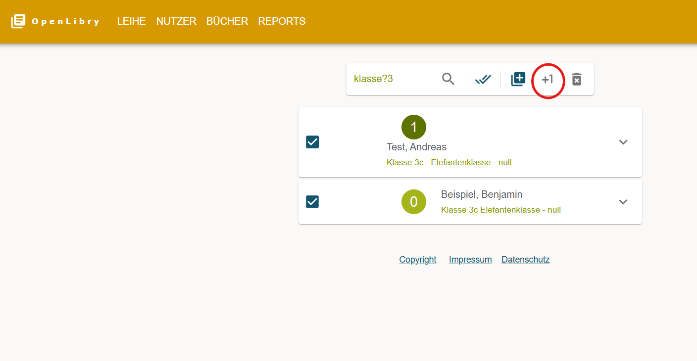
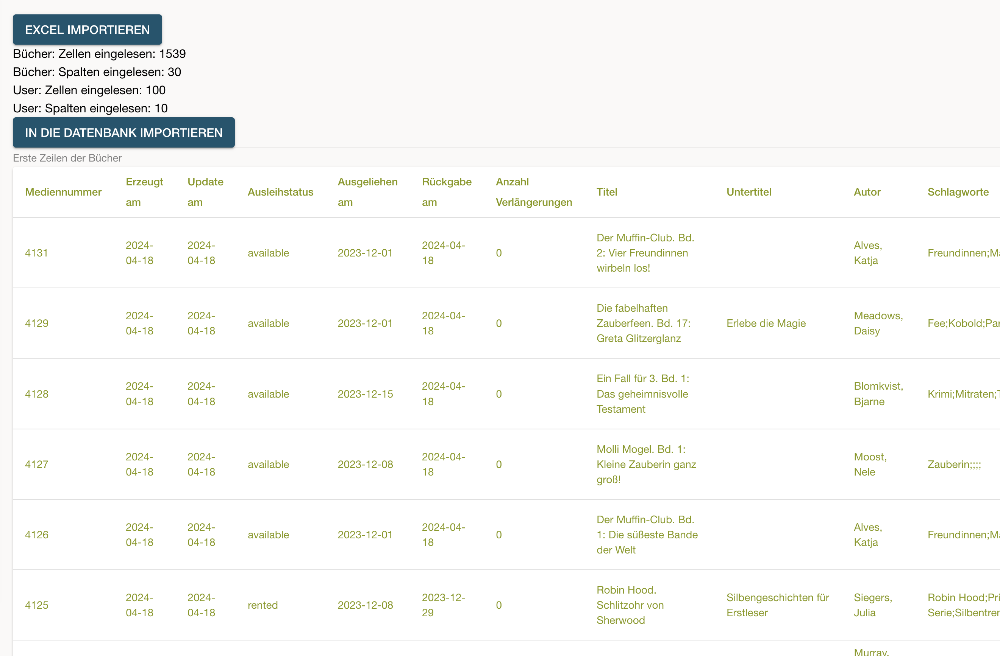

# OpenLibry - Die einfache und freie Software für die Schulbibliothek

OpenLibry ist eine einfache, schnelle und offene Verwaltung für kleine Bibliotheken, z.B. in Schulen. Sie wurde optimiert auf einfache Bedienung in einer trubeligen Umgebung, in der kleine Kinder Bücher abgeben, ausleihen, weitergeben und liegen lassen.

## Idee
Die Idee entstand in unserer Grundschule, in der OpenBiblio im Einsatz war, eine quelloffene und kostenlose Software, die aber schon seit vielen Jahren nicht mehr gepflegt wird. Viele Eltern und Freiwillige engagieren sich ehrenamtlich, um die Bücher zu katalogisieren, Nutzer-Ausweise zu drucken und zu Ausleihzeiten zur Verfügung zu stehen - trotzdem habe ich keine kostenlose digitale Lösung gefunden, um sie zu unterstützen. So entstand die Idee zu **OpenLibry**.

## Features

- Nutzbar auf Computer, Tablet und Handy
- On-the-fly-Suche während man tippt nach Büchern, Leihen und NutzerInnen. Einfacher Filter für überfällige Bücher in einer Klasse direkt im Ausleih-Screen
- Optimiert auf wenige Maus- und Tastaturklicks, insbesondere für die Ausleihe und Rückgabe
- Cover-Bilder für Bücher können eingefügt werden
- Einfache Installation in einer lokalen Umgebung oder in einer Cloud
- Kein komplizierter Schnickschnack mit Nutzerberechtigungen, drölfzig unnötigen Datenfeldern usw.
- Moderner Software-Stack mit next.js-Oberfläche und einfacher Datenbank
- Importfunktion für Daten von alten OpenBiblio-Installationen

## Screenshots

Start-Screen


Ausleih-Screen


Bücherverwaltung-Screen


Edit-Screen


## Benutzung
### Ausleihe
Der Ausleih-Screen ist auf vereinfachte Benutzung mit einem Barcodelesegerät ausgerichtet. Initial liegt der Fokus auf dem Benutzersuchfeld. Durch scannen des Benutzerbarcodes wird der Nutzer ausgewählt (Der Barcodeleser muss dazu einen Enter-Befehl senden. Dies ist für die meisten Lesegeräte die Standardeinstellung oder lässt sich konfigurieren). Der Nutzer wird ausgeklappt, es können manuell Bücher zurück gegeben werden.

Der Fokus springt automatisch auf die Büchersuche. Hier kann das zu leihende Buch gescannt werden und manuell ausgeliehen werden. Nach dem Leih- oder Rückgabevorgang wird automatisch der Inhalt des Buchsuchfeldes markiert, so dass direkt nach dem nächsten Buch gesucht werden kann. Alternativ löscht Esc den Inhalt, und ein erneutes Esc springt zurück zur Nutzersuche.

Bücher können auch per Klick verlängert werden. Die Option zur Verlängerung wird nicht angezeigt, wenn bereits die aktuell maximale Ausleihzeit erreicht ist.

### Benutzerverwaltung
In der Nutzerverwaltung können sämtliche Nutzer / Leiher angepasst und neue erstellt werden. Mehrere Nutzer können markiert und im Paket gelöscht werden. 

Ebenso kann die Klasse im neuen Schuljahr hier einfach erhöht werden. Dazu erst die Nutzer auswählen / markieren, und dann auf `+1` klicken. Im Klassennamen wird der Zahlenanteil dabei um eins erhöht.


### Bücherlabel
Nachdem die Bücherlabel konfiguriert wurden (siehe [Konfiguration der Bücherlabel](#bookLabelConfig)) können unter 'REPORTS' Bücherlabel gedruckt werden. Es gibt mehrere verschiedene Möglichkeiten, die zu druckenden Bücher auszuwählen:


- Entweder man wählt die Anzahl der neuestens Labels, die gedruckt werden sollen (erster Input). OpenLibry wird dann ausgehend von der neuesten / höchsten ID Nummer rückwärts die ausgewählte Anzahl an Büchern auswählen zum drucken.
- Oder man bestimmt einen Bereich von ID Nummern, von dem man die Label drucken will. Dazu `Von ID` und `Bis ID` ausfüllen (leere Felder werden zu ID 0 für `Von ID` bzw. letzte vergeben ID für `Bis ID`).
- Alternativ kann auch explizit ein bestimmtes Buch per ID ausgewählt werden.
- Wenn Schlagwörter in den Büchern gepflegt sind, so können diese als zusätzlichen Filter ausgewählt werden (Optional).

`Erzeuge PDF` erzeugt dann eine PDF Datei der Label. Alternativ kommt man mit `Überspringe Label` in einen Dialog, bei dem einzelne Label deaktiviert werden könne, wenn diese auf einem Labelbogen bereits benutzt wurden:


Mit Links- oder Rechtsklick können einzelne Label deaktiviert werden. Diese Label werden nur auf der ersten Seite übersprungen.

Alternativ kann in der Bücherverwaltung (`Bücher`) ein einzelnes Buchlabel gedruckt werden. Auch hier besteht direkt die Möglichkeit, einzelne Labels des Bogens zu deaktivieren.
## Installation und Konfiguration 

- Kopiere das Beispiel-Environment-File: `cp .env_example .env`
- Konfiguriere den Servernamen in einer `.env`-Datei im Hauptordner entsprechend der Werte im `.env_example`, z.B. `NEXT_PUBLIC_API_URL="http://localhost:3000"
`
- Der Wert `AUTH_ENABLED` sollte zunächst auf `false` gesetzt werden, so dass man sich beim ersten Login ohne Authentifizierung einloggen kann. Via `https://<domain>/auth/register` kann man dann den ersten User anlegen und danach `AUTH_ENABLED` auf `true` setzen.


### Konfiguration der Bücherlabel {#bookLabelConfig}
Die Bücherlabels sind zum ausdrucken auf A4 Labelpapier gedacht. Sowohl die Größe als auch der Inhalt lässt sich in der .env Datei anpassen.
Ränder oben, links sowie horizontale und vertikale Abstände zwischen den Labels lassen sich in cm angeben. Zur genaueren Positionierung kann mit `BOOKLABEL_PRINT_LABEL_FRAME` ein Ramen um die einzelnen Labels erstellt werden. Dieser kann nach dem Ausrichten wieder deaktiviert werden, oder zum ausschneiden benutz werden.

Das Label erlaubt bis zu vier separate Datenblöcke zusätzlich zu einem Barcode Label. Ein Block (`BOOKLABEL_AUTHORLINE`) ist links am Rand und um 90° gedreht. Ein Block (`BOOKLABEL_LINE_ABOVE`) ist oberhalb des Barcodes, bis zu zwei (`BOOKLABEL_LINE_BELOW_1` und `BOOKLABEL_LINE_BELOW_2`) unterhalb. Diese können auch leer gelassen werden. Unterhalb des Barcodes wird die Buch-ID ausgegeben.

In den Datenblöcken können - ähnlich wie beim Benutzerausweis - alle Felder aus dem Buch sowie Freitext abgebildet werden. `["Titel: Book.title",10,"left"]` würde z.B. den Text "Titel: " gefolgt vom Titel des Buches in Schriftgröße 10 und linksbündig ausgeben.

Beispiel:


### Konfiguration der Benutzerausweise
Wie die Bücherlabel sind auch die Benutzerausweise zum ausdruck auf DinA4 Papier gedacht, dass danach zugeschnitten und z.B. laminiert werden kann. 

Der Benutzerausweis besteht aus einem Bild und darauf oder da drunter den Datenblöcken. Im Gegensatz zum Bücherlabel können jedoch beliebig viele Datenblöcke eingefügt werden.

`USERLABEL_WIDTH` gibt die Breite des Bildes an. Es kann eine beliebige CSS Einheit angegeben werden, z.B.
- `cm` für Angaben in cm
- `px` für Angaben in Pixel
- `vw` für Angaben in Prozent relativ zur Größe

Mit `USERLABEL_SEPARATE_COLORBAR` kann unterhalb des Bildes ein zusätzlicher farbiger Balken eingebracht werden, um z.B. einen Kontrast für die Datenblöcke zu liefern. Die Größe ist hier in Pixeln.

Beispiel für einen Datenblock:
`USERLABEL_LINE_1= ["User.firstName User.lastName","75%","3%","35vw","2pt","black",14]`
Dies erzeugt einen Block mit 75% Abstand zum oberen Ausweisrand und 3% zum linken Rand über 35% der relativen Größe. 2 Punkte Rand innerhalb des Blockes, Schritfgröße 14 und Schriftfarbe Schwarz. Als Text wird Vor- und Nachname des benutzers ausgegeben.

`BARCODE_MINCODELENGTH` setzt die minimale Barcodelänge sowohl für Bücher- als auch Nutzerausweis fest. Dies kann notwendig sein für einen Barcodescanner, der eine bestimmte minimale Barcodelänge benötigt. Die Codes werden mit Leerzeichen ausgefüllt, was in den Suchmasken ignoriert wird.

### Bare Metal am Beispiel Raspberry Pi

Für eine lokale Installation ohne Docker befolge diese Schritte:

- Update der Distribution: `sudo apt-get update` und `sudo apt-get upgrade`
- Falls `curl` nicht installiert ist: `apt install curl`
- Installiere den node version manager NVM: `curl -o- https://raw.githubusercontent.com/nvm-sh/nvm/v0.39.1/install.sh | bash`. Damit sollte `nvm` installiert sein.
 - Installiere den node server: `nvm install --lts`
 - Falls noch kein `git` installiert ist: `sudo apt-get install git-all` 
 - Kopiere das Repository aus github: `git clone https://github.com/jzakotnik/openlibry.git`
 - Nutze das entsprechende Verzeichnis: `cd openlibry`
 - Kopiere das Beispielfile und passe den API-Endpunkt mit dem entsprechenden Servernamen an: `cp .env_example .env` und ggf. `nano .env`
- Installiere alle notwendigen node-Pakete: `npm install`
- Erzeuge eine leere Datenbank (SQLite): `npx prisma db push`
- Starte OpenLibry mit `npm run dev`. Achte darauf, dass der entsprechende Port freigegeben ist und über den Browser zugänglich ist.

### Docker
#### Testbetrieb oder dauerhafte Installation mit Docker (Getestet mit Linux Mint 21.3)

Erledige zunächst folgende Vorarbeiten:

Update der Distribution: `sudo apt-get update` und `sudo apt-get upgrade`

Falls curl nicht installiert ist: `sudo apt install curl`

Installiere den node version manager NVM: `curl -o- https://raw.githubusercontent.com/nvm-sh/nvm/v0.39.1/install.sh | bash` 

Installiere den node server (Vorher Neustart des Terminals notwendig.): `nvm install --lts`

Falls noch kein git installiert ist: `sudo apt-get install git-all`


Installiere, falls noch nicht vorhanden, Docker an sich:

```
curl -fsSL https://download.docker.com/linux/ubuntu/gpg | sudo gpg --dearmor -o /usr/share/keyrings/docker.gpg
echo "deb [arch=$(dpkg --print-architecture) signed-by=/usr/share/keyrings/docker.gpg] https://download.docker.com/linux/ubuntu jammy stable" | sudo tee /etc/apt/sources.list.d/docker.list > /dev/null
sudo apt update 
sudo apt install docker-ce docker-ce-cli containerd.io docker-buildx-plugin docker-compose-plugin
sudo usermod -aG docker ${USER}
sudo systemctl is-active docker
```

Danach ist eine Neuanmeldung/Neustart nötig, damit die Änderungen an den Nutzergruppen (usermod) aktiv werden. 

Anschließend kannst du OpenLibry installieren. Dabei bieten sich zwei Modi an: Entweder ein Sandbox-Modus zum Ausprobieren, bei dem nach Beendigung der Ausführung alles wieder entfernt wird. Oder die dauerhafte Installation, die auch automatisch mit Rechnerstart, bei Abstürzen etc. wieder mit startet.
Folgende Schritte sind so oder so zu erledigen (Zum Beispiel im Home-Verzeichnis):

- Kopiere das Repository aus github: `git clone https://github.com/jzakotnik/openlibry.git`
- Wechsle in das dabei dabei entstandene Verzeichnis: `cd openlibry`
- Anschließend musst du die Konfiguration/individuelle Anpassung von OpenLibry vornehmen: Zum einen müssen Bilddateien mit den Logos deiner Institution hinterlegt werden. Diese befinden sich im "public" Unterordner, du kannst dich dabei an den vorhandenen Beispielbildern orientieren. Weiterhin muss eine ".env"-Datei angelegt werden. (Hinweis: Dateien mit führenden Punkt sind in der grafischen Oberfläche standardmäßig "unsichtbar". Die Tastenkombination "Strg-h" macht sie sichtbar.) Kopiere dazu die vorhandene ".env_example" Datei nochmal in den Ordner und benenne sie dabei um in ".env":
 `cp .env_example .env`
- Bearbeite die entstandene ".env" Datei mit einem Texteditor und passe die dort beschriebenen Werte entsprechend an, das sind zum Beispiel die Ausleihdauer usw. (Technische Werte, die du aktuell noch nicht verstehst, kannst du auf den voreingestellten Werten belassen.). Dazu gehört u.a. auch, Logos (entsprechende Bilddateien) sowie einen Standard-Mahnungstext (.docx-Datei) im OpenLibry-Unterordner "public" zu hinterlegen. Dabei kann man sich an den schon hinterlegten Beispieldateien orientieren, das gilt insbesondere auch für die Datei mit dem Standard-Mahnungstext "mahnung-template.docx", die du einfach anpassen kannst.
- Anschließend kannst du Docker alle notwendigen Schritte automatisch übernehmen lassen: `docker build --no-cache -t openlibry:latest .`

Das weitere Vorgehen unterscheidet sich je nach Absicht:

**a) Sandbox-Modus zum rückstandsfreien Ausprobieren:** 


- Docker Container starten: 
```
docker run --rm -p 3000:3000 -v "$(pwd)/database:/app/database" -e AUTH_SECRET="someSecret" -e DATABASE_URL="file:/app/database/dev.db" jzakotnik/openlibry:latest

```
- Öffne OpenLibry im Browser und probiere es aus: `http://localhost:3000` (voreingestellter Standard-Wert oder sonst entsprechend deiner Einstellung in der .env-Datei)
- Zum Beenden den Prozess in der Konsole abrechen mit der Tastenkombination "Strg-c". 
- Optional das Docker-Image löschen: `docker image rm openlibry `
- Troubleshooting: Falls was nicht funktioniert, kann man die Servers logs im Docker container sehen oder die Frontend Logs in der Browser Developer Console
- In dem existierenden Folder wird ein Datenbank file im Folder `./database` erzeugt, d.h. falls in der Sandbox Daten angelegt werden, bleiben diese hier erhalten. Falls diese nicht erzeugt werden kann. Falls der Ordner nicht erzeugt werden kann, kann es an den Permissions vom Host liegen, in diesem Fall den Owner ändern: `docker run --rm --entrypoint sh jzakotnik/openlibry:latest -c 'id -u'` und den entsprechenden User als owner des Folder machen `sudo chown 1000:1000 database`


**b) Dauerhafte Installation**

- Docker Container dauerhaft starten, er wird dabei auch nach jedem Neustart, Absturz etc. automatisch neu gestartet: `docker compose up` (Hierbei wird Docker gestartet mit Parametern, die in der Datei docker-compose.yml hinterlegt sind. Unter anderem sind hier Volumes angelegt, in welchen die User-Daten deiner Installation liegen. Nach einem Update deines Docker-Containers sind diese dann weiterhin vorhanden.)
- Öffne OpenLibry im Browser: `http://localhost:3000` (voreingestellter Standard-Wert oder sonst entsprechend deiner Einstellung in der .env-Datei)
- Bei Bedarf kannst du die Ausführung dieses Containers manuell stoppen, dann startet er auch nicht sofort automatisch wieder neu: `docker stop openlibry`
- Bei Bedarf kannst du nach dieser Variante alles zu OpenLibry in Docker wieder löschen:  Du kannst den Container und das Image in Docker wieder entfernen mit: `docker rm openlibry` und `docker image rm openlibry`

**Docker allgemeiner Hinweis zu Speicherplatz**
- Du experimentierst viel rum und eventuell läuft dein Speicher voll? Docker könnte die Ursache sein, alte Images und build-Dateien kannst du löschen. Bitte bei Bedarf selbstständig mit den folgenden Hinweisen die Details recherchieren, um ALLE (!) builder-Dateien zu löschen folgende Anweisung ausführen: `docker builder prune` , um ALLE (!!!) Images zu löschen funktioniert `docker image prune -a`


### Installation mit nginx als reverse proxy und pm2 als Package Manager

Eine Installationsanleitung für die Konfiguration mit dem Webserver nginx auf einer Subdomain findet sich [hier](./doc/WebServerInstall.md)

### Initialisierung mit einem ersten User
- Setze die Auth Variable in `.env` auf `false` um sich ohne Authentifizierung anzumelden
- Via `/auth/register` erzeuge einen neuen User
- Setze die Auth Variable auf `true`

## REST-API

Die REST-API kennt die Resourcen `book` und `user`. Für beide gibt es jeweils die entsprechenden http-Operationen (GET, PUT, POST, DELETE). Die Ausleihe entsteht durch die Verknüpfung von `user` und `book`, also z.B. `http://localhost:3000/api/book/2001/user/1080`, um ein Buch auszuleihen.

Die API kann verwendet werden, um User/Bücher aus anderen Programmen automatisiert zu importieren.

Weitere Beispiele sind im [docs](./doc/sampleAPIRequests/)-Folder aufgeführt.


## Suche in Antolin Datensatz

Um Bücher einfacher mit dem Schlagwort der Antolin Leseförderung versehen zu können, kann der Antolin Export des Westermann Verlags eingebunden werden. Dazu kann man Westermann/Antolin kontaktieren und bekommt dort einen Link auf eine csv Datei mit dem Export alles Antolin Bücher. Dieser ist im Ordner `/public/antolin/antolingesamt.csv` abzulegen.
Im Edit-Screen der Bücher kann man dann sehen ob ähnliche Bücher in der Antolin Datenbank vorhanden sind.
. OpenLibry durchsucht dabei die Datenbank nach Datensätzen bei denen der Autor und Titel vorkommmen, insbesondere wenn es keinen direkten Link via ISBN gibt. 

## Konfiguration von Mahnschreiben / Templates

Um automatisierte Mahnschreiben zu erzeugen, verwendet OpenLibry eine Template Bibliothek, welche eine Word Datei als Muster verwendet und dann entsprechende Platzhalter einsetzen kann. Die Platzhalter können im `.env` File konfiguriert. Ein Beispiel ist in folgendem [Template](./public/mahnung-template.docx) zu finden.


## Import und Export aus Excel

Um bestehende Daten zu importieren bzw. Daten aus OpenLibry zu exportieren gibt es eine Excel Funktion. Diese kann auch verwendet werden, um Backups zu erzeugen und bei Bedarf wieder zu importieren.

### Excel Export

Für das Erzeugen einer Excel Datei kann auf der Reports Seite die Kachen *Excel Export* angeklickt werden. Dadurch downloadet der Browser ein Excel mit 2 Blättern: Bücher und User. 

Das Worksheet *Userliste* enthält folgende Spalten:
- Erzeugt am
- Update am
- Nummer
- Nachname
- Vorname
- Klasse
- Lehrkraft
- Freigeschaltet
- eMail

Das Worksheet *Bücherliste* enthält folgende Spalten:
- Mediennummer
- Erzeugt am
- Update am
- Ausleihstatus
- Ausgeliehen am
- Rückgabe am
- Anzahl Verlängerungen
- Titel
- Untertitel
- Autor
- Schlagworte
- Bild
- ISBN
- Edition
- Verlagsort
- Seiten
- Zusammenfassung
- Min Spieler
- Verlag
- Merkmale
- Beschaffung
- Publikationsdatum
- Abmessungen
- Min Alter
- Max Alter
- Material
- Preis
- Links
- Ausgeliehen von

### Excel import

Für den Import einer Excel Datei kann auf der Reports Seite die Kachel Excel Import angeklickt werden. Diese führt zu einer Import-Seite.

Für den Import von Daten gibt es zwei Stufen:
1. Zunächst kann das Excel hochgeladen werden. Eine Vorschau zeigt an, wieviele User und Bücher importiert werdne und die jeweiligen ersten Zeilen werden dargestellt. Die Spalten des Excel Files müssen denen entsprechen, die auch beim export erzeugt werden. Ein Beispiel-Excel File findet sich [hier](./doc/sample_export.xlsx). Nach dem Upload sieht der Bildschirm so aus: 

2. Wenn die Vorschau wie erwartet aussieht, kann mit dem Button *In die Datenbank importieren* importiert werden. Dabei muss eine leere Datenbank bereits existieren, wie in der Anleitung beschrieben.

## Import aus OpenBiblio und anderen Tools

Siehe [Open Biblio](https://openbiblio.de/), die [Import-Schritte](./doc/OpenBiblioImport.md)

Das Datenmodell für Bücher beinhaltet aktuell folgende Felder (alle optional bis auf Titel und Autor). Die anderen Felder sind im [Schema](./prisma/schema.prisma) einsehbar:
| Feld-Name  | Funktion  |
|---|---|
|id| Mediennummer|        
|rentalStatus |Ausleihstatus (available, rented, lost)|
|rentedDate  |Ausleihdatum|
|dueDate      |Rückgabedatum|
|renewalCount |Anzahl Verlängerungen|
|title        |Titel|
|subtitle   |Untertitel|
|author    |Autor(en)|
|topics    |Schlagwörter mit Semikolon getrennt|
|imageLink  |Cover Bild|
|isbn         |ISBN Nummer|           
|editionDescription|Edition / Band|
|publisherLocation|Verlagsort|
|pages              |Anzahl Seiten|    
|summary             |Zusammenfassung|
|minPlayers          |Anzahl Spieler (bei Brettspielen)|
|publisherName   |Verlag|
|otherPhysicalAttributes|Andere physische Eigenschaften (bei Brettspielen)| 
|supplierComment       |Quelle, z.B. Spende|
|publisherDate           |Publikationsdatum|
|physicalSize            |Abmessungen|
|minAge                  |Mindestalter|
|maxAge                  |Höchstalter|
|additionalMaterial    |Zusätzliches Material, z.B. CD oder DVD|
|price                   |Preis|
|externalLinks   |Externe Verknüpfungen|


Falls Cover importiert werden:
ISBN-Service für ISBN-10 und ISBN-13: 
https://openlibrary.org/isbn/9780140328721
Cover: 
https://covers.openlibrary.org/13834659


## Kontakt

Falls Ihr mitmachen wollt, die Software nutzen wollt oder ein Hosting sucht, schreibt mich gerne unter [info@openlibry.de](info@openlibry.de) an. Falls Ihr die Software finanziell unterstützen wollt, geht es bei [Ko-Fi](https://ko-fi.com/jzakotnik) sehr einfach.
