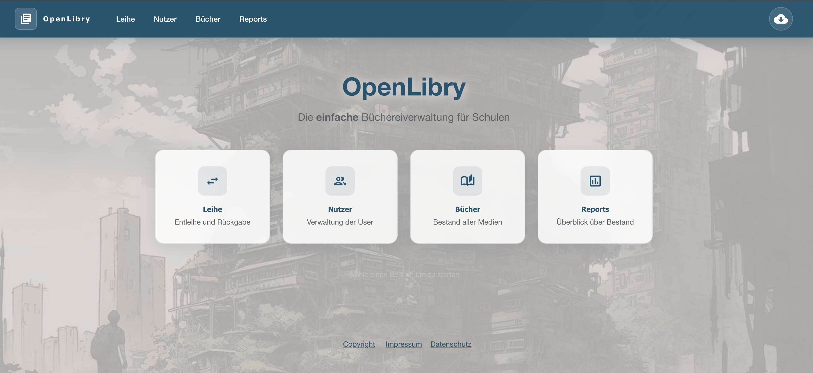

# OpenLibry

**Die einfache und freie Software für die Schulbibliothek**

[](https://github.com/jzakotnik/openlibry)
[](LICENSE)
[](https://hub.docker.com/r/jzakotnik/openlibry)

OpenLibry ist eine moderne, benutzerfreundliche Open-Source-Lösung für kleine Bibliotheken, insbesondere in Schulen. Die Software wurde speziell für den hektischen Alltag entwickelt, in dem Kinder Bücher ausleihen, zurückgeben und verwalten.

[](https://youtu.be/2UIFdA6Lqaw?si=5YP4eNZX5wCBMmBJ)

*▶️ Klicke auf das Bild für ein 12-minütiges Intro-Video*

---

## 🚀 Quickstart

Mit Docker kannst du OpenLibry in wenigen Sekunden ausprobieren:

```bash
docker run --rm -p 3000:3000 \
  --name openlibry \
  -e NEXTAUTH_SECRET=wunschpunsch \
  -e SECURITY_HEADERS=insecure \
  -e COVERIMAGE_FILESTORAGE_PATH=/app/database \
  jzakotnik/openlibry:release
```

Öffne [http://localhost:3000](http://localhost:3000) – fertig!

> ⚠️ **Hinweis**: Dies ist zum Ausprobieren gedacht. Die Daten werden nach Beendigung gelöscht. Für eine produktive Installation siehe die [Installationsanleitung](https://openlibry.de/site/installation/).

---

## ✨ Features

| Feature | Beschreibung |
|---------|--------------|
| **Plattformunabhängig** | Läuft auf Computer, Tablet und Smartphone |
| **Intelligente Suche** | Echtzeit-Suchergebnisse während du tippst |
| **Barcode-Support** | Optimiert für schnelle Ausleihe mit Scanner |
| **Cover-Bilder** | Automatischer Import von Buchcovern |
| **Flexible Installation** | Raspberry Pi, Docker oder Cloud |
| **Datenübernahme** | Import aus OpenBiblio und Excel |

---

## 📸 Screenshots

<table>
  <tr>
    <td><br/><em>Start-Screen</em></td>
    <td><br/><em>Ausleih-Screen</em></td>
  </tr>
  <tr>
    <td><br/><em>Bücherverwaltung</em></td>
    <td><br/><em>Buch bearbeiten</em></td>
  </tr>
</table>

---

## 📖 Dokumentation

Die vollständige Dokumentation findest du unter **[openlibry.de/site](https://openlibry.de/site/)**

| Thema | Beschreibung |
|-------|--------------|
| [🔧 Installation](https://openlibry.de/site/installation/) | Raspberry Pi, Docker, nginx |
| [⚙️ Konfiguration](https://openlibry.de/site/configuration/) | Ausleihzeiten, Labels, Mahnungen |
| [📖 Benutzerhandbuch](https://openlibry.de/site/user-guide/) | Tägliche Arbeit mit OpenLibry |
| [🔄 Import/Export](https://openlibry.de/site/import/) | Daten migrieren und sichern |
| [🛠️ API & Entwicklung](https://openlibry.de/site/development/) | Für Entwickler |

---

## 🤝 Mitmachen & Unterstützen

OpenLibry entstand aus dem Bedarf einer Grundschule und wird ehrenamtlich weiterentwickelt.

**Du möchtest helfen?**

- 🐛 [Issues melden](https://github.com/jzakotnik/openlibry/issues) – Bugs oder Feature-Wünsche
- 💻 [Pull Requests](https://github.com/jzakotnik/openlibry/pulls) – Code beitragen
- 📧 [info@openlibry.de](mailto:info@openlibry.de) – Fragen & Hosting-Unterstützung
- ☕ [Ko-Fi](https://ko-fi.com/jzakotnik) – Projekt finanziell unterstützen

---

<p align="center">
  <strong>OpenLibry</strong> – Entwickelt mit ❤️ für Schulbibliotheken und ehrenamtliche Helfer
</p>