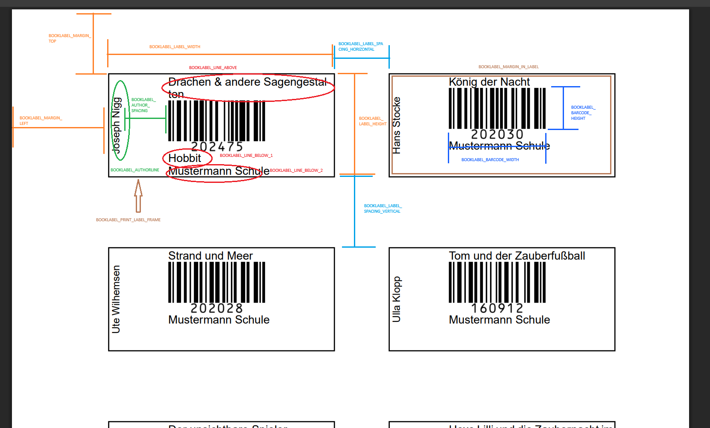

# Bücherlabels konfigurieren

Passe die Etiketten für deine Bücher an – Größe, Layout und Inhalt.

## Übersicht

Bücherlabels werden als PDF generiert und auf A4-Etikettenpapier gedruckt. Die Konfiguration erfolgt über die `.env`-Datei und umfasst:

- Größe und Position der Labels
- Inhalt (welche Buchdaten erscheinen)
- Barcode-Format und -Größe
- Optional: Schullogo

## Etikettenpapier

OpenLibry ist optimiert für gängige Etikettenbögen:

| Produkt | Zeilen × Spalten | Labelgröße |
|---------|------------------|------------|
| AVERY Zweckform L4732 | 16 × 4 | 35.6 × 16.9 mm |
| AVERY Zweckform 3659 | 8 × 3 | 63.5 × 33.9 mm |
| Herma 4200 | 8 × 2 | 96.5 × 33.8 mm |

!!! tip "Eigene Bögen"
    Du kannst jedes beliebige Format konfigurieren. Miss einfach die Maße aus.

## Schnellstart

Für AVERY Zweckform L4732 (Mini-Labels, 16 × 4) füge diese Zeilen in deine `.env`-Datei ein:

```env
BOOKLABEL_MARGIN_LEFT=0.6
BOOKLABEL_MARGIN_TOP=1.3
BOOKLABEL_LABEL_WIDTH=3.56
BOOKLABEL_LABEL_HEIGHT=1.69
BOOKLABEL_ROWSONPAGE=16
BOOKLABEL_COLUMNSONPAGE=4
BOOKLABEL_BARCODE_WIDTH=2cm
BOOKLABEL_BARCODE_HEIGHT=0.8cm
BOOKLABEL_AUTHORLINE=["Book.author",6,"left"]
BOOKLABEL_LINE_BELOW_1=["Book.title",6,"left"]
```

Die folgenden Abschnitte erklären jede Einstellung im Detail.

## Layout konfigurieren

Das Layout definiert, wo und wie groß die Labels auf der Seite erscheinen.



### Ränder und Größe

```env
# Ränder vom Seitenrand (cm)
BOOKLABEL_MARGIN_LEFT=0.6
BOOKLABEL_MARGIN_TOP=1.3

# Größe eines Labels (cm)
BOOKLABEL_LABEL_WIDTH=3.56
BOOKLABEL_LABEL_HEIGHT=1.69

# Innenrand im Label (cm)
BOOKLABEL_MARGIN_IN_LABEL=0.1
```

### Anordnung auf der Seite

```env
# Anzahl Labels pro Seite
BOOKLABEL_ROWSONPAGE=16
BOOKLABEL_COLUMNSONPAGE=4

# Abstände zwischen Labels (cm)
BOOKLABEL_LABEL_SPACING_HORIZONTAL=0.25
BOOKLABEL_LABEL_SPACING_VERTICAL=0
```

### Hilfsrahmen

Zum Ausrichten kannst du einen Rahmen um jedes Label zeichnen lassen:

```env
BOOKLABEL_PRINT_LABEL_FRAME=true
```

## Inhalt konfigurieren

Jedes Label kann bis zu vier Textbereiche plus Barcode enthalten:

| Variable | Position |
|----------|----------|
| `BOOKLABEL_AUTHORLINE` | Links am Rand, um 90° gedreht |
| `BOOKLABEL_LINE_ABOVE` | Oberhalb des Barcodes |
| `BOOKLABEL_LINE_BELOW_1` | Unterhalb des Barcodes (Zeile 1) |
| `BOOKLABEL_LINE_BELOW_2` | Unterhalb des Barcodes (Zeile 2) |

Die Buch-ID wird automatisch unter dem Barcode ausgegeben.

### Format der Textbereiche

Jeder Textbereich wird als JSON-Array definiert:

```env
BOOKLABEL_AUTHORLINE=["Book.author", 8, "left"]
```

**Aufbau**: `["Inhalt", Schriftgröße, Ausrichtung]`

- **Inhalt**: Text oder Platzhalter (siehe unten)
- **Schriftgröße**: Zahl in Punkt
- **Ausrichtung**: `left`, `center` oder `right`

Du kannst auch festen Text mit Platzhaltern kombinieren:

```env
BOOKLABEL_LINE_ABOVE=["Titel: Book.title", 10, "left"]
```

### Verfügbare Platzhalter

| Platzhalter | Wird ersetzt durch |
|-------------|-------------------|
| `Book.title` | Buchtitel |
| `Book.author` | Autor |
| `Book.topics` | Alle Schlagworte |
| `Book.isbn` | ISBN |
| `Book.id` | Mediennummer |
| `firstTopic` | Erstes Schlagwort |

### Schullogo hinzufügen

1. Speichere dein Logo als PNG in `/public/` (transparenter Hintergrund ideal)
2. Setze den Dateinamen:

```env
BOOKLABEL_LOGO=school_logo.png
```

## Barcode konfigurieren

```env
# Größe des Barcodes
BOOKLABEL_BARCODE_WIDTH=3cm
BOOKLABEL_BARCODE_HEIGHT=1.6cm

# Format (code128 empfohlen)
BOOKLABEL_BARCODE_VERSION=code128

# Minimale Zeichenlänge (wichtig für manche Scanner)
BARCODE_MINCODELENGTH=4
```

!!! note "Scanner-Kompatibilität"
    Manche Barcode-Scanner erfordern eine Mindestlänge. Mit `BARCODE_MINCODELENGTH=4` wird z.B. Buch-ID `42` als `0042` kodiert.

## Beispielkonfigurationen

### AVERY Zweckform 3659 (Mittlere Labels, 8 × 3)

```env
BOOKLABEL_MARGIN_LEFT=0.7
BOOKLABEL_MARGIN_TOP=1.3
BOOKLABEL_LABEL_WIDTH=6.35
BOOKLABEL_LABEL_HEIGHT=3.39
BOOKLABEL_ROWSONPAGE=8
BOOKLABEL_COLUMNSONPAGE=3
BOOKLABEL_BARCODE_WIDTH=3cm
BOOKLABEL_BARCODE_HEIGHT=1.2cm
BOOKLABEL_AUTHORLINE=["Book.author",8,"left"]
BOOKLABEL_LINE_ABOVE=["firstTopic",8,"center"]
BOOKLABEL_LINE_BELOW_1=["Book.title",8,"left"]
```

### Große Labels (2 × 5)

```env
BOOKLABEL_MARGIN_LEFT=1.0
BOOKLABEL_MARGIN_TOP=1.5
BOOKLABEL_LABEL_WIDTH=9.5
BOOKLABEL_LABEL_HEIGHT=5.0
BOOKLABEL_ROWSONPAGE=5
BOOKLABEL_COLUMNSONPAGE=2
BOOKLABEL_BARCODE_WIDTH=4cm
BOOKLABEL_BARCODE_HEIGHT=2cm
BOOKLABEL_AUTHORLINE=["Book.author",10,"left"]
BOOKLABEL_LINE_ABOVE=["Book.topics",9,"center"]
BOOKLABEL_LINE_BELOW_1=["Book.title",10,"left"]
BOOKLABEL_LINE_BELOW_2=["Book.isbn",8,"left"]
```

## Ausrichten und Troubleshooting

Falls die Labels nicht perfekt auf dem Etikettenpapier sitzen:

### Testdruck auf Normalpapier

1. Setze `BOOKLABEL_PRINT_LABEL_FRAME=true`
2. Drucke auf normales Papier
3. Halte es gegen das Licht mit dem Etikettenbogen dahinter
4. Prüfe die Ausrichtung

### Ränder anpassen

- Labels zu weit **links** → `BOOKLABEL_MARGIN_LEFT` erhöhen
- Labels zu weit **oben** → `BOOKLABEL_MARGIN_TOP` erhöhen

### Drucker-Einstellungen prüfen

- Drucke mit **100% Skalierung** (keine Anpassung!)
- Deaktiviere "An Seite anpassen"
- Nutze randlosen Druck wenn möglich

## Angefangene Bögen nutzen

Hast du einen Etikettenbogen, auf dem schon einige Labels fehlen?

1. Gehe zu **Reports** → **Buch Etiketten**
2. Klicke **Überspringe Label**
3. Klicke auf die bereits verwendeten Positionen (nur erste Seite)
4. Erzeuge das PDF

So verschwendest du keine Etikettenbögen!

## Tipps

### Lange Titel abschneiden

Titel werden automatisch gekürzt. Die maximale Länge kannst du anpassen:

```env
BOOKLABEL_MAX_AUTHORLINE_LENGTH=25
```

### Schriftgrößen-Empfehlungen

| Labelgröße | Empfohlene Schriftgröße |
|------------|------------------------|
| Klein (L4732) | 6–8 pt |
| Mittel (3659) | 8–10 pt |
| Groß | 10–12 pt |

## Nächste Schritte

- [Reports & Labels](../user-guide/reports.md) – Labels drucken
- [Benutzerausweise](user-cards.md) – Ausweise für Bibliotheksnutzer konfigurieren