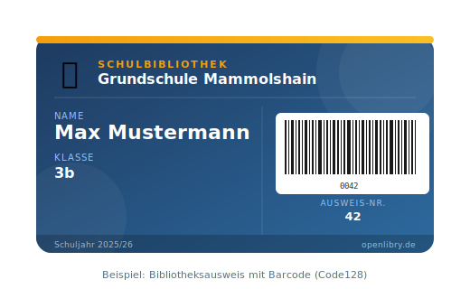

# Benutzerausweise konfigurieren

Erstelle Bibliotheksausweise mit Barcode für deine Nutzer.

## Übersicht

Benutzerausweise werden als PDF erstellt und können auf Papier oder Karton gedruckt, ausgeschnitten und laminiert werden.



## Konfiguration

### Grundeinstellungen

```env
# Hintergrundbild (Dateiname ohne Pfad – wo die Datei liegt, siehe Abschnitt "Hintergrundbild")
USERID_LABEL_IMAGE=ausweis_hintergrund.png

# Breite des Ausweises (CSS-Einheiten: cm, px, vw)
USERLABEL_WIDTH=9cm

# Ausweise pro Seite
USERLABEL_PER_PAGE=6

# Optionaler Farbbalken unter dem Bild (Höhe in px, 0 = aus)
USERLABEL_SEPARATE_COLORBAR=0
```

### Barcode

```env
# Format: [Top, Left, Breite, Höhe, Barcode-Typ]
USERLABEL_BARCODE=["10%","60%","30%","15%","code128"]
```

### Datenzeilen

Du kannst beliebig viele Zeilen definieren:

```env
# Format: ["Inhalt", Top, Left, Breite, Padding, Farbe, Schriftgröße]
USERLABEL_LINE_1=["User.firstName User.lastName","75%","3%","35vw","2pt","black",14]
USERLABEL_LINE_2=["Klasse: User.schoolGrade","82%","3%","35vw","2pt","black",12]
USERLABEL_LINE_3=["Schulbibliothek","5%","3%","35vw","2pt","white",10]
```

## Verfügbare Platzhalter

| Platzhalter | Wird ersetzt durch |
|-------------|-------------------|
| `User.firstName` | Vorname |
| `User.lastName` | Nachname |
| `User.schoolGrade` | Klasse |
| `User.id` | Ausweisnummer |
| `User.eMail` | E-Mail |

## Hintergrundbild

1. Erstelle ein Bild mit deinem Design (z.B. Schullogo, Farben)
2. Empfohlene Größe: 400×250 px oder ähnliches Seitenverhältnis
3. Speichere das Bild – **je nach Installation an unterschiedlichen Orten** (siehe unten)
4. Setze `USERID_LABEL_IMAGE=dein_bild.png`

!!! tip "Canva"
    Tools wie [Canva](https://canva.com) eignen sich super zum Erstellen von Ausweis-Designs.

### Wo speichere ich das Bild?

=== "Docker"

    Lege das Bild in den `database/custom/`-Ordner auf dem **Host-System**:

    ```bash
    cp ausweis_hintergrund.png ~/openlibry/database/custom/ausweis_hintergrund.png
    ```

    Dieser Ordner ist über das Docker-Volume gemountet und bleibt bei Container-Updates
    automatisch erhalten. OpenLibry sucht Dateien zuerst in `database/custom/` – wird die
    Datei dort nicht gefunden, greift es auf die Standarddatei im Image zurück.

    !!! info "Warum nicht `/public/`?"
        Der `public/`-Ordner ist fest ins Docker-Image eingebaut und wird nicht als Volume
        gemountet. Dateien die dort abgelegt werden gehen beim nächsten `docker compose pull`
        verloren. Eigene Dateien gehören deshalb immer in `database/custom/`.

=== "Bare Metal"

    Lege das Bild direkt in den `public/`-Ordner der OpenLibry-Installation:

    ```bash
    cp ausweis_hintergrund.png /pfad/zu/openlibry/public/ausweis_hintergrund.png
    ```

## Beispielkonfiguration

```env
# Hintergrundbild
USERID_LABEL_IMAGE=bibliotheksausweis.png

# Größe
USERLABEL_WIDTH=8.5cm
USERLABEL_PER_PAGE=8

# Barcode (rechts unten)
USERLABEL_BARCODE=["70%","60%","35%","20%","code128"]

# Text
USERLABEL_LINE_1=["User.firstName User.lastName","45%","5%","50%","2pt","#333333",12]
USERLABEL_LINE_2=["Klasse User.schoolGrade","55%","5%","50%","2pt","#666666",10]
USERLABEL_LINE_3=["Schulbibliothek Musterstadt","5%","5%","90%","2pt","#ffffff",8]
```

## Ausweise drucken

1. Gehe zu **Reports** → **Ausweise**
2. Wähle Nutzer aus:
   - Alle Nutzer
   - Nach Klasse filtern
   - ID-Bereich
3. Klicke **Erzeuge PDF**
4. Drucke auf Karton oder dickes Papier
5. Ausschneiden und laminieren

## Tipps

### Laminieren

Laminierte Ausweise halten viel länger! Investiere in ein kleines Laminiergerät (~30€).

### Farben

Nutze Hex-Codes für Farben: `"#ff0000"` (rot), `"#333333"` (dunkelgrau)

### Positionierung

Die Prozent-Werte beziehen sich auf das gesamte Ausweis-Element:

- `Top`: Abstand von oben
- `Left`: Abstand von links
- `Breite`: Maximale Breite des Textbereichs

## Nächste Schritte

- [Reports](../user-guide/reports.md) – Ausweise drucken
- [Bücherlabels](book-labels.md) – Bücher-Etiketten