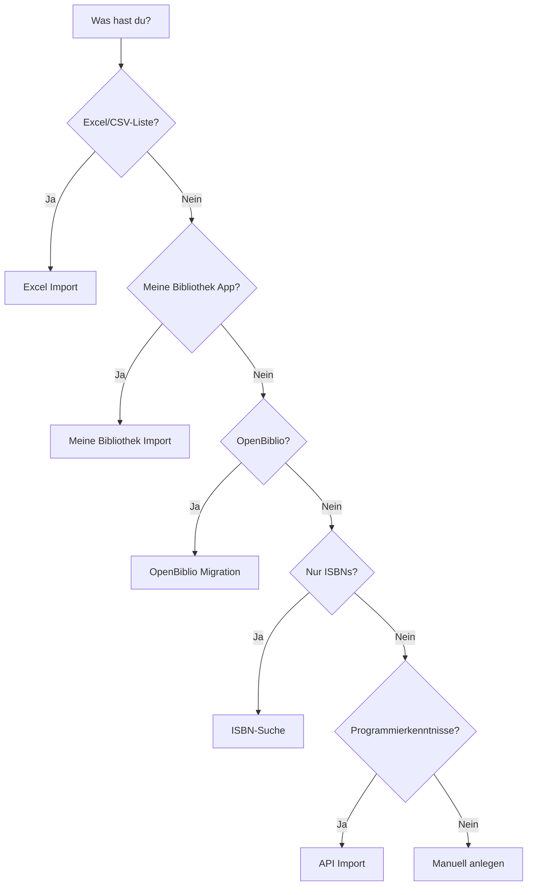

# Daten importieren

Du hast bereits Bücher und Nutzer in einem anderen System? Hier erfährst du, wie du sie nach OpenLibry bekommst.

## Übersicht

| Quelle | Format | Schwierigkeit | Empfohlen für |
|--------|--------|---------------|---------------|
| [Excel/CSV](excel-generic.md) | .xlsx | ⭐ Einfach | Neue Bibliotheken, manuelle Listen |
| [Meine Bibliothek](meine-bibliothek.md) | .csv | ⭐ Einfach | Android-App Nutzer |
| [OpenBiblio](openbiblio.md) | SQL → JSON | ⭐⭐⭐ Fortgeschritten | Legacy-Systeme |
| [ISBN-Suche](isbn-lookup.md) | Einzeln | ⭐ Einfach | Bücher ohne Daten ergänzen |
| [API](api-import.md) | JSON | ⭐⭐⭐ Entwickler | Automatisierte Imports |

## Welcher Import passt zu mir?



## Vor dem Import

!!! warning "Backup erstellen!"
    Erstelle vor jedem Import ein Backup deiner Datenbank!
    
    ```bash
    cp database/dev.db database/dev.db.backup
    ```

### Import in leere Datenbank

Der einfachste Fall: Du startest mit einer komplett neuen Installation.

1. Installiere OpenLibry
2. Importiere deine Daten
3. Fertig!

### Import in bestehende Datenbank

Vorsicht bei bestehendem Datenbestand:

- **Mediennummern**: Dürfen nicht doppelt vorkommen
- **Nutzernummern**: Dürfen nicht doppelt vorkommen
- **Konflikte**: Werden je nach Importart unterschiedlich behandelt

## Datenformat

### Bücher

Mindestens benötigt:

- **Titel** (Pflicht)
- **Autor** (Pflicht)

Empfohlen:

- **Mediennummer** (wird sonst automatisch vergeben)
- **ISBN** (für Cover und Metadaten)
- **Schlagworte** (für Filter)

Alle Felder: [Datenmodell](../reference/data-model.md)

### Nutzer

Mindestens benötigt:

- **Vorname** (Pflicht)
- **Nachname** (Pflicht)

Empfohlen:

- **Klasse**
- **Ausweisnummer** (wird sonst automatisch vergeben)

## Häufige Probleme

### Umlaute werden falsch dargestellt

→ Stelle sicher, dass die Datei UTF-8 kodiert ist.

In Excel: "Speichern unter" → "CSV UTF-8"

### IDs werden doppelt vergeben

→ Entweder alle IDs vorgeben oder alle automatisch generieren lassen.

### Import bricht ab

→ Prüfe die Fehlermeldung. Meist fehlt ein Pflichtfeld (Titel, Autor).

## Nächste Schritte

- [Excel Import](excel-generic.md) – Der einfachste Weg
- [Meine Bibliothek App](meine-bibliothek.md) – Export aus der Android-App
- [OpenBiblio Migration](openbiblio.md) – Für bestehende OpenBiblio-Installationen
