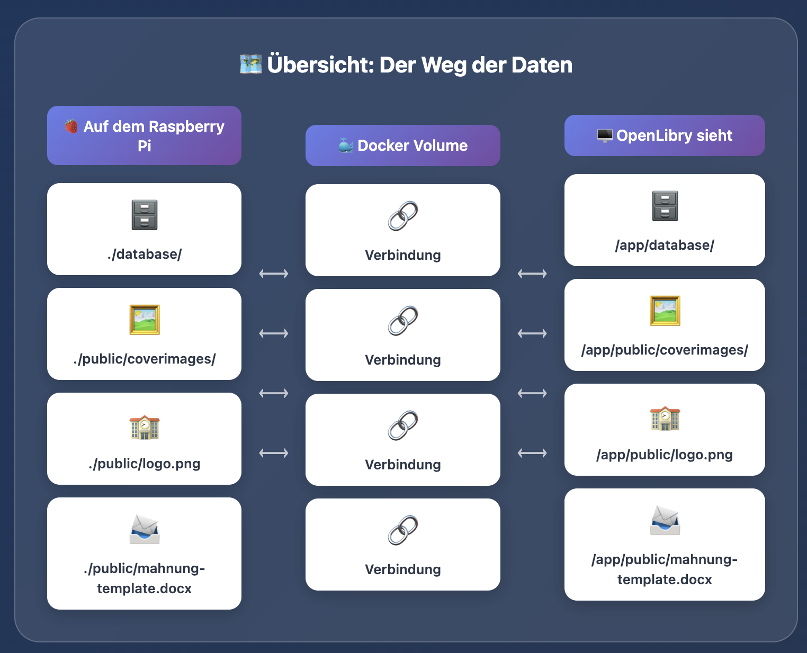

# Container-Installation (Docker)

Diese Anleitung führt dich durch die Installation von OpenLibry mit Docker. Am Ende läuft OpenLibry unter `http://localhost:3000` oder auf dem entsprechenden host wie `http://raspberrypi:3000`. 

**Willst du HTTPS mit eigener Domain?** In dem Fall ist es sinnvoll einen Reverse Proxy zu nutzen, der die SSL Verbindung aufbaut und sie an den OpenLibry Server weiterleitet. Folge erst dieser Anleitung, und danach [nginx & SSL](nginx-ssl.md).

## Voraussetzungen

- Linux-Server oder Desktop (Ubuntu, Debian, Raspberry Pi OS)
- Mindestens 2 GB RAM
- 2 GB freier Speicherplatz

## Schritt 1: Docker installieren

Falls Docker noch nicht installiert ist:

```bash
# System aktualisieren
sudo apt-get update
sudo apt-get upgrade -y

# Docker-Repository einrichten
curl -fsSL https://download.docker.com/linux/ubuntu/gpg | sudo gpg --dearmor -o /usr/share/keyrings/docker.gpg

echo "deb [arch=$(dpkg --print-architecture) signed-by=/usr/share/keyrings/docker.gpg] https://download.docker.com/linux/ubuntu jammy stable" | sudo tee /etc/apt/sources.list.d/docker.list > /dev/null

# Docker installieren
sudo apt update
sudo apt install docker-ce docker-ce-cli containerd.io docker-buildx-plugin docker-compose-plugin -y

# Benutzer zur Docker-Gruppe hinzufügen
sudo usermod -aG docker ${USER}
```

**Wichtig**: Nach der Installation einmal abmelden und neu anmelden, damit die Gruppenänderung aktiv wird.

Prüfen, ob Docker läuft:

```bash
docker --version
sudo systemctl is-active docker
```

## Schritt 2: OpenLibry vorbereiten und konfigurieren

Im Unterschied zur temporären Installation werden im Server Ordner für die Datenbank und die Cover angelegt, die auch verbleiben, wenn der Docker Container gelöscht oder geupdatet wird. Diese müssen entsprechende Zugangsrechte haben, damit der Docker Daemon diese nutzen kann. Falls was nicht funktioniert sind es in 90% der Fälle ein Permission Problem.

Der Weg der Daten ist also intern für den Server anders als er von außen auf dem Docker Host zu sehen ist.


Deshalb diese Ordner erstellen:

```bash
# Verzeichnis erstellen
mkdir -p ~/openlibry
cd ~/openlibry

# Volumes anlegen, node user ist typischerweise uid 1000, nicht root!
mkdir -p database images
sudo chown -R 1000:1000 database images
```

Erstelle eine `.env` Datei im openlibry folder, entweder über diesen [Link](https://github.com/jzakotnik/openlibry/blob/main/.env_example)
```sh
wget -O .env https://raw.githubusercontent.com/jzakotnik/openlibry/main/.env_example
``` 

In der `.env` Datei ist die Konfiguration gespeichert, z.B. welche Domain, wie die Anmeldung aussieht oder wie die Schule heisst. Du kannst diese jederzeit anpassen und den Container danach neu starten. Falls Du Authentifizierung mit Login verwendest musst Du die entsprechende Domain hier einsetzen:
```
NEXTAUTH_URL=http://<domain>:3000
```
damit die URL nach dem Login korrekt aufgerufen wird.


Erstelle eine `docker-compose.yml`:
```yaml
services:
  openlibry:
    image: jzakotnik/openlibry:release
    container_name: openlibry
    restart: unless-stopped
    ports:
      - "3000:3000"
    volumes:
      - ./database:/app/database
      - ./images:/app/images
    env_file:
      - .env
```

Starten:

```bash
docker compose up -d
```

OpenLibry läuft jetzt unter `http://localhost:3000` und startet automatisch nach einem Neustart.

## Schritt 3: Ersten Benutzer anlegen

1. Öffne `http://localhost:3000/auth/register`
2. Erstelle einen Admin-Benutzer
3. Bearbeite die `.env` und setze `AUTH_ENABLED=true`
4. Container neu starten: `docker compose restart`

## Eigene Vorlagen anpassen

Beim ersten Start erstellt OpenLibry automatisch einen Ordner `database/custom/` innerhalb des Datenbank-Volumes. Dort kannst du eigene Dateien ablegen, die die im Image enthaltenen Standarddateien überschreiben:

| Datei | Beschreibung | Standard im Image |
|-------|--------------|-------------------|
| `school_logo.png` | Schullogo für Bücherlabels | OpenLibry-Platzhalter |
| `mahnung-template.docx` | Vorlage für Mahnschreiben | Standard-Vorlage |
| `ausweis_hintergrund.png` | Hintergrundbild für Benutzerausweise | Standard-Hintergrund |
| `antolin/antolingesamt.csv` | Antolin-Datenliste | nicht enthalten |

Da der `custom/`-Ordner innerhalb des `database`-Volumes liegt, bleiben deine Anpassungen bei Container-Updates automatisch erhalten und werden auch bei einem regulären Datenbank-Backup mitgesichert.

### Beispiel

```bash
# Schullogo ablegen
cp /pfad/zu/mein_logo.png ~/openlibry/database/custom/school_logo.png

# Eigene Mahnungsvorlage ablegen
cp /pfad/zu/meine_mahnung.docx ~/openlibry/database/custom/mahnung-template.docx

# Antolin-Daten (Unterverzeichnis!)
mkdir -p ~/openlibry/database/custom/antolin
cp /pfad/zu/antolingesamt.csv ~/openlibry/database/custom/antolin/

# Container neu starten, damit die Dateien erkannt werden
docker compose restart
```

!!! tip "Kein extra Volume nötig"
    Der `custom/`-Ordner nutzt das bestehende `database`-Volume. Du musst nichts an der `docker-compose.yml` ändern.

!!! info "Wie funktioniert das?"
    OpenLibry sucht zuerst in `database/custom/` nach der Datei. Wird sie dort nicht gefunden, wird die Standarddatei aus `public/` verwendet. So funktioniert alles auch ohne eigene Dateien.

## Nützliche Befehle

```bash
# Status anzeigen
docker compose ps

# Logs anzeigen
docker compose logs -f

# Stoppen
docker compose stop

# Stoppen und Container entfernen
docker compose down

# Update auf neue Version
docker compose pull
docker compose up -d
```

## Speicherplatz aufräumen

Bei vielen Experimenten können alte Images Speicherplatz belegen:

```bash
# Ungenutzte Images löschen
docker image prune -a

# Builder-Cache leeren
docker builder prune
```

## Berechtigungsprobleme?

Falls der database-Ordner nicht erstellt werden kann:

```bash
# Benutzer-ID im Container herausfinden
docker run --rm --entrypoint sh jzakotnik/openlibry:latest -c 'id -u'

# Ordner mit korrekten Rechten erstellen
mkdir -p database
sudo chown -R 1000:1000 database
```

## Nächste Schritte

- [nginx & SSL einrichten](nginx-ssl.md) – Für HTTPS und eigene Domain
- [Konfiguration](../configuration/index.md) – Labels, Mahnungen, etc.
- [Upgrading](upgrading.md) – Auf neue Versionen aktualisieren