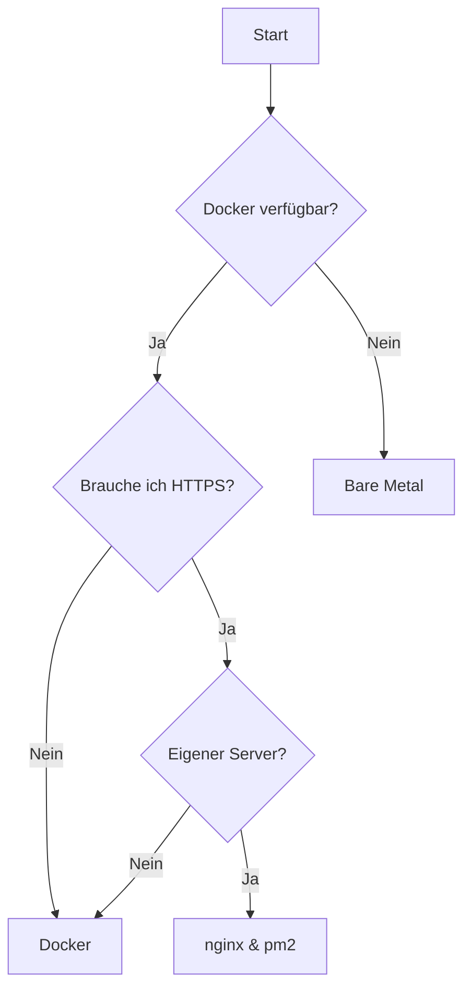

# Installation

Es gibt mehrere Wege, OpenLibry zu installieren. Welcher passt zu dir?

## Übersicht der Methoden

| Methode | Schwierigkeit | Empfohlen für |
|---------|---------------|---------------|
| [Docker](docker.md) | ⭐ Einfach | Die meisten Nutzer |
| [Bare Metal](bare-metal.md) | ⭐⭐ Mittel | Raspberry Pi, volle Kontrolle |
| [nginx & pm2](nginx-pm2.md) | ⭐⭐⭐ Fortgeschritten | Produktivbetrieb mit HTTPS |

## Welche Methode soll ich wählen?

### Docker (Empfohlen)

**Wähle Docker, wenn:**

- Du OpenLibry schnell zum Laufen bringen willst
- Du keine Lust auf Abhängigkeiten hast
- Du regelmäßige Updates willst
- Du Docker bereits kennst oder lernen möchtest

**Vorteile:**

- ✅ Ein Befehl zum Starten
- ✅ Keine Konflikte mit anderen Programmen
- ✅ Einfache Updates
- ✅ Funktioniert überall gleich

[→ Docker-Installation](docker.md)

### Bare Metal

**Wähle Bare Metal, wenn:**

- Du einen Raspberry Pi nutzen willst
- Du volle Kontrolle über alle Komponenten brauchst
- Docker auf deinem System nicht läuft
- Du die Software verstehen und anpassen willst

**Vorteile:**

- ✅ Direkter Zugriff auf alle Dateien
- ✅ Kein Docker-Overhead
- ✅ Ideal für Raspberry Pi
- ✅ Maximale Flexibilität

[→ Bare Metal Installation](bare-metal.md)

### nginx & pm2

**Wähle diese Methode, wenn:**

- Du OpenLibry über das Internet erreichbar machen willst
- Du HTTPS mit eigenem Zertifikat brauchst
- Du mehrere Instanzen auf einem Server betreiben willst
- Du einen "richtigen" Server hast

**Vorteile:**

- ✅ HTTPS mit Let's Encrypt
- ✅ Eigene Domain möglich
- ✅ Professionelles Setup
- ✅ Mehrere Instanzen möglich

[→ Installation mit nginx & pm2](nginx-pm2.md)

## Schnellentscheidung

## Nach der Installation

Egal welche Methode du wählst, danach geht's weiter mit:

1. [Erste Einrichtung](../getting-started/first-steps.md) – Admin-Nutzer anlegen
2. [Konfiguration](../configuration/index.md) – Einstellungen anpassen
3. [Benutzerhandbuch](../user-guide/index.md) – Loslegen!

## Hilfe bei Problemen

Etwas funktioniert nicht? Schau hier:

- [Fehlerbehebung](../troubleshooting/index.md)
- [Docker-Probleme](../troubleshooting/docker-issues.md)
- [Datenbank-Probleme](../troubleshooting/database-issues.md)

Oder schreib uns: [info@openlibry.de](mailto:info@openlibry.de)
