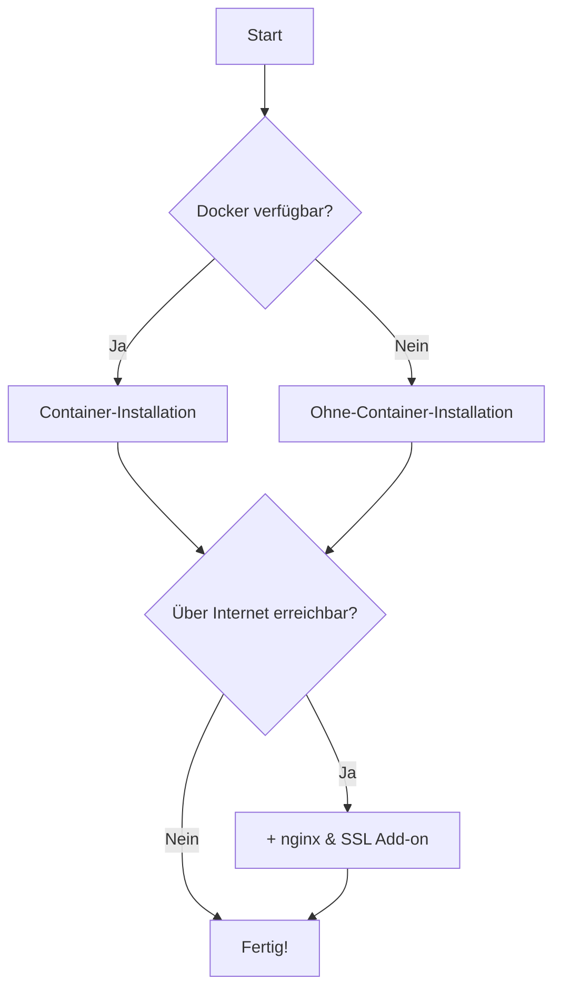

# Installation

OpenLibry lässt sich flexibel installieren. Zwei Fragen helfen bei der Entscheidung:

## 1. Wie soll OpenLibry laufen?

| Methode | Beschreibung | Empfohlen für |
|---------|--------------|---------------|
| [Container (Docker)](container.md) | Alles in einem Image verpackt | Schneller Start, einfache Updates |
| [Ohne Container](ohne-container.md) | Node.js direkt auf dem System | Raspberry Pi, volle Kontrolle |

## 2. Wie greifst du darauf zu?

| Zugriff | URL-Beispiel | Wann sinnvoll |
|---------|--------------|---------------|
| Direkt | `http://192.168.1.50:3000` | Internes Schulnetz |
| Mit nginx + SSL | `https://bibliothek.schule.de` | Zugriff über Internet |

## Die 4 Kombinationen

|  | Direkt (http, Port 3000) | Mit nginx + SSL (https) |
|--|--------------------------|-------------------------|
| **Container** | Einfachste Option | Produktiv mit Domain |
| **Ohne Container** | Raspberry Pi, volle Kontrolle | Produktiv ohne Docker |

## Schnellentscheidung

## Welche Methode passt zu dir?

### Container (Docker) — Empfohlen

**Wähle Docker, wenn:**

- Du OpenLibry schnell zum Laufen bringen willst
- Du keine Lust auf Abhängigkeiten hast
- Du regelmäßige Updates willst

**Vorteile:**

- Ein Befehl zum Starten
- Keine Konflikte mit anderen Programmen
- Einfache Updates
- Funktioniert überall gleich

[→ Container-Installation](container.md)

### Ohne Container (Node.js direkt)

**Wähle diese Methode, wenn:**

- Du einen Raspberry Pi nutzen willst
- Du volle Kontrolle über alle Komponenten brauchst
- Docker auf deinem System nicht läuft

**Vorteile:**

- Direkter Zugriff auf alle Dateien
- Kein Docker-Overhead
- Ideal für Raspberry Pi
- Maximale Flexibilität

[→ Installation ohne Container](ohne-container.md)

### nginx & SSL — Add-on

**Füge nginx hinzu, wenn:**

- OpenLibry über das Internet erreichbar sein soll
- Du HTTPS mit eigenem Zertifikat brauchst
- Du eine eigene Domain hast

Dieses Add-on funktioniert mit **beiden** Installationsmethoden.

[→ nginx & SSL einrichten](nginx-ssl.md)

## Nach der Installation

Egal welche Methode du wählst, danach geht's weiter mit:

1. [Erste Einrichtung](../getting-started/first-steps.md) – Admin-Nutzer anlegen
2. [Konfiguration](../configuration/index.md) – Einstellungen anpassen
3. [Benutzerhandbuch](../user-guide/index.md) – Loslegen!

## Hilfe bei Problemen

Etwas funktioniert nicht?

- [Fehlerbehebung](../troubleshooting/index.md)
- [Docker-Probleme](../troubleshooting/docker-issues.md)
- [Datenbank-Probleme](../troubleshooting/database-issues.md)

Oder schreib uns: [info@openlibry.de](mailto:info@openlibry.de)
