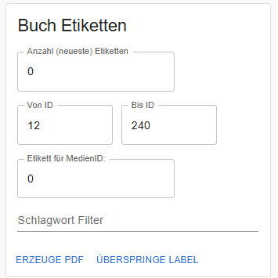
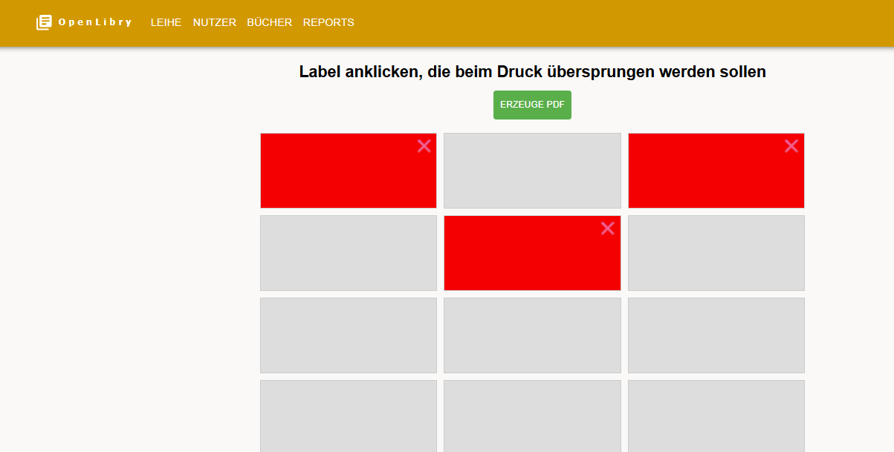

# Reports & Labels

Im Reports-Bereich findest du Übersichten, Statistiken und die Möglichkeit, Etiketten und Dokumente zu erstellen.

## Dashboard

Klicke auf **Reports** in der Navigation. Das Dashboard zeigt dir auf einen Blick:

| Kachel | Zeigt |
|--------|-------|
| **Leihe** | Anzahl aktuell ausgeliehener Bücher |
| **Nutzerinnen** | Gesamtzahl aller Nutzer |
| **Bücher** | Gesamtzahl aller Bücher |
| **Verspätet** | Bücher über dem Rückgabedatum |

Darunter siehst du eine Schlagwort-Wolke mit den häufigsten Themen deiner Bibliothek.

## Bücherlabels drucken

So druckst du Barcode-Etiketten für deine Bücher:

### Bücher auswählen

Du hast vier Möglichkeiten:

| Methode | Beschreibung |
|---------|--------------|
| **Neueste Labels** | Gib eine Anzahl ein – OpenLibry wählt rückwärts von der höchsten ID |
| **ID-Bereich** | Definiere "Von ID" bis "Bis ID" (leere Felder = ID 0 bzw. letzte ID) |
| **Einzelnes Buch** | Gib eine spezifische Buch-ID ein |
| **Schlagwort-Filter** | Zusätzlich nach Schlagwort filtern |

### PDF erstellen

1. Wähle deine Bücher mit einer der Methoden oben aus
2. Klicke **Erzeuge PDF**
3. Drucke das PDF auf Etikettenpapier (z.B. AVERY Zweckform)

### Angefangene Bögen weiterverwenden

Hast du einen Etikettenbogen, der schon teilweise benutzt ist?

1. Klicke **Überspringe Label**
2. Klicke auf die Labels, die leer bleiben sollen (nur auf der ersten Seite möglich)
3. Erzeuge das PDF

So verschwendest du keine Etikettenbögen!

!!! tip "Einzelnes Label"
    In der Bücherverwaltung kannst du auch direkt ein einzelnes Label für ein Buch drucken.

!!! info "Konfiguration"
    Die Größe und das Layout der Etiketten kannst du anpassen. Siehe [Bücherlabels konfigurieren](../configuration/book-labels.md).

## Benutzerausweise drucken

1. Gehe zu **Reports** → **Ausweise**
2. Wähle Nutzer aus (nach Klasse oder alle)
3. Klicke **Erzeuge PDF**
4. Drucke, schneide aus und laminiere

!!! info "Konfiguration"
    Siehe [Benutzerausweise konfigurieren](../configuration/user-cards.md).

## Mahnschreiben erstellen

Für überfällige Bücher kannst du automatisch Mahnbriefe generieren:

1. Gehe zu **Reports** → **Mahnungen**
2. Wähle die überfälligen Ausleihen
3. Klicke **Mahnschreiben erstellen**
4. Ein Word-Dokument (.docx) wird erstellt

Das Dokument enthält automatisch:

- Name des Nutzers
- Liste der überfälligen Bücher mit Rückgabedatum
- Dein Schullogo und individueller Text

!!! info "Konfiguration"
    Siehe [Mahnschreiben konfigurieren](../configuration/reminders.md).

## Daten exportieren

Exportiere alle Daten als Excel-Datei:

1. Klicke auf **Excel Export**
2. Eine Datei mit zwei Blättern wird erstellt:
   - **Userliste**: Alle Nutzer mit Details
   - **Bücherliste**: Alle Bücher mit Details

Ideal für Backups, eigene Auswertungen oder Berichte an die Schulleitung.

## Daten importieren

Importiere Daten aus einer Excel-Datei:

1. Klicke auf **Excel Import**
2. Wähle eine Excel-Datei (Format muss dem Export entsprechen)
3. Prüfe die Vorschau
4. Klicke **In die Datenbank importieren**

!!! warning "Achtung"
    Der Import funktioniert nur in eine leere Datenbank. Für Details siehe [Excel-Import](../import/excel-generic.md).

## Listen & Übersichten

### Nutzerliste

Klicke auf **Nutzerinnen** für eine tabellarische Übersicht aller Bibliotheksnutzer:

- Sortierbar nach jeder Spalte
- Filterbar nach Namen, Klasse etc.
- Exportierbar

### Bücherliste

Klicke auf **Bücher** für eine Übersicht aller Medien:

- Alle Bücher mit Details
- Sortier- und filterbar
- Zeigt aktuellen Ausleihstatus

### Leihenliste

Klicke auf **Leihen** für alle aktuellen Ausleihen:

- Wer hat was ausgeliehen
- Ausleihdatum und Rückgabedatum
- Anzahl der Verlängerungen

## Historie / Audit

Klicke auf **Historie** für ein Protokoll aller Aktivitäten:

- Ausleihen und Rückgaben
- Verlängerungen
- Änderungen an Büchern und Nutzern

Nützlich für:

- Nachvollziehen von Problemen ("Wer hat das Buch zuletzt gehabt?")
- Statistiken über die Zeit
- Dokumentation für die Schulleitung

## Nächste Schritte

- [Bücherlabels konfigurieren](../configuration/book-labels.md) – Layout und Inhalt anpassen
- [Benutzerausweise konfigurieren](../configuration/user-cards.md) – Design der Ausweise
- [Mahnschreiben konfigurieren](../configuration/reminders.md) – Vorlage anpassen